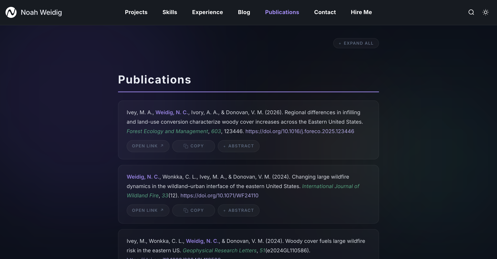

<div align="center">



<br><br>

# Noah Weidig · Publications

**Wildfire ecology, landscape dynamics, and the wildland-urban interface.**

[](https://noahweidig.github.io/pubs)

</div>

<br>

This repository powers the **Publications** section of my personal site. A scheduled GitHub Action pulls citation data from my [Zotero](https://www.zotero.org/) library, renders it into a static page, and deploys it to GitHub Pages — no client-side API calls, no JavaScript frameworks, just fast, clean HTML.

<br>

## How It Works

```
Zotero Library ──▸ GitHub Action (every 14 days) ──▸ index.html ──▸ GitHub Pages
```

1. A **cron-triggered workflow** fetches my publications from the Zotero Web API.
2. `scripts/update-pubs.js` sanitizes the data and injects formatted entries into `index.html`.
3. The updated file is committed automatically and served via **GitHub Pages**.

Visitors never hit an external API. The page loads instantly and works offline.

<br>

## Stack

| Layer | Details |
|------:|:--------|
| **Data** | [Zotero Web API v3](https://www.zotero.org/support/dev/web_api/v3/start) — My Publications collection |
| **Build** | Node.js script with `node-fetch` + `sanitize-html` |
| **CI/CD** | GitHub Actions on a 14-day cron schedule |
| **Hosting** | GitHub Pages — zero cost, zero maintenance |
| **Design** | Dark & light themes, Inter typeface, CSS-only interactions |

<br>

## Features

- **Dark / Light mode** with smooth toggle
- **Expandable abstracts** for every entry
- **One-click citation copy** and direct DOI links
- **Search & filter** with real-time results
- **Six swappable CSS themes** — academic, modern, minimal, nature, dark, and default
- **XSS-safe** — all Zotero output is sanitized before render

<br>

## Repository Layout

```
.
├── index.html               # The publication page (auto-updated)
├── scripts/
│   ├── update-pubs.js       # Zotero fetch → HTML injection
│   └── sanitize.js          # XSS sanitization layer
├── themes/                  # Drop-in stylesheets
│   ├── default.css
│   ├── academic.css
│   ├── modern.css
│   ├── dark.css
│   ├── minimal.css
│   └── nature.css
├── assets/
│   ├── icon.png
│   └── logo.svg
└── .github/workflows/
    └── update.yml           # Scheduled CI pipeline
```

<br>

## License

[MIT](LICENSE)
