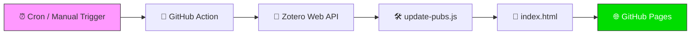

<div align="center">

# 📚 Zotero → Static Publications Page

**Automatically generate a beautiful, static publications page from your Zotero library.**

[](https://github.com/noahweidig/Zotero/actions/workflows/update.yml)
[](https://noahweidig.github.io/Zotero)
[](LICENSE)

<br>

*Zero client-side JavaScript · Zero API calls on page load · Embeddable anywhere*

---

</div>

## 🔭 Overview

This repository pulls publications from a Zotero **My Publications** library and builds a static HTML page on a schedule. The result is committed to `index.html` and served via **GitHub Pages** — ready to embed in Google Sites, WordPress, or any personal website.

> **Why static?** Visitors never hit the Zotero API. The page loads instantly and works offline.

<br>

## ⚙️ How It Works



| Step | What happens |
|-----:|:-------------|
| **1** | A GitHub Action runs every **14 days** (or on-demand via manual trigger). |
| **2** | The action calls the [Zotero Web API](https://www.zotero.org/support/dev/web_api/v3/start) to fetch publication data (`/users/<userID>/publications`). |
| **3** | `scripts/update-pubs.js` formats the data and injects it between `<!-- START PUBS -->` / `<!-- END PUBS -->` markers in `index.html`. |
| **4** | The updated file is committed and pushed automatically. |
| **5** | GitHub Pages serves the fresh static site. |

<br>

## 📁 Repository Structure

```
.
├── index.html                 # Static page served by GitHub Pages
├── package.json               # Node.js dependency manifest (node-fetch)
├── scripts/
│   └── update-pubs.js         # Fetches Zotero data & injects HTML
└── .github/
    └── workflows/
        └── update.yml         # Scheduled GitHub Action (cron)
```

<br>

## 🚀 Quick Start

### 1. Fork & Configure

1. **Fork** this repository.
2. Update the `userID` in [`scripts/update-pubs.js`](scripts/update-pubs.js) with your own Zotero user ID.
3. Enable **GitHub Pages** in your repo:
   > **Settings → Pages → Deploy from branch → `main` → `/ (root)`**

### 2. Run Manually

> **Actions → `Update Zotero Publications` → Run workflow**

This triggers an immediate update instead of waiting for the next scheduled run.

### 3. Embed

Paste the published URL into any site that supports embedding:

```
https://YOUR_USERNAME.github.io/Zotero
```

<br>

## 🕒 Adjust Update Frequency

Edit the cron schedule in [`.github/workflows/update.yml`](.github/workflows/update.yml):

| Frequency | Cron Expression |
|----------:|:----------------|
| Every 14 days *(default)* | `0 0 */14 * *` |
| Weekly (Monday) | `0 0 * * 1` |
| Daily | `0 0 * * *` |

<br>

## 📋 Requirements

| Requirement | Details |
|------------:|:--------|
| **Zotero library** | Must be set to **public** |
| **GitHub Pages** | Enabled on the `main` branch, root directory |
| **`index.html`** | Must remain in the **repository root** |

<br>

## 📄 License

Released under the [MIT License](LICENSE) — use freely.
